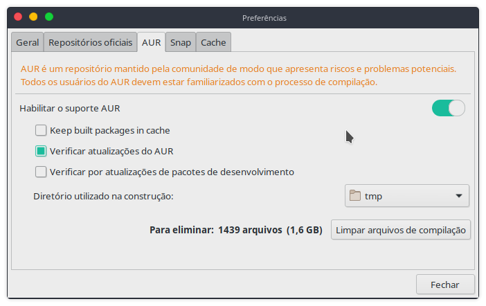

#### Como criar um localhost HTTPS com mkcert e docker

##### Relação de ferramentas
```
docker
docker-compose
mkcert (brew para a instalação do mkcert dependendo do so)
```

##### Manjaro KDE
Habilite o repositório AUR na interface gráfica em: ``Adicione ou remova programas instalados no sistema > menu no canto superior direito > Preferências > Tab AUR``



Agora faça a busca por:
```
docker (atualmente está como docker  1:19.03.4-1)
docker-compose (atualmente está como docker-compose  1.24.1-1)
mkcert (atualmente está como mkcert  1.4.1-1)
```
E as compile, lembrando que este processo são todas pela interface gráfica do ``Adicione ou remova programas instalados no sistema``

Depois de compilado utilizando esta mesma estrutura do git acesse o caminho em que foi salvo os arquivos e pastas, execute: ``sudo docker-compose up``

Aguarde a montagem de todas das imagens, caso obtenha um erro e queira remontar todo o processo segue abaixo alguns comandos.

**observação:** deixarei na ordem exata para que todos os comandos funcionem com sucesso

#### Desmonte os containers: 

``sudo docker ps -a`` (para listar todos os containers)

Verifique se temos algum como ``Up x hours`` na coluna ``STATUS``, caso sim, será necessário "stopa-los".
Caso não, prossiga para o processo de desmontagem

utilizaremos os ``CONTAINER ID`` para a ``desmontagem`` e ``stop service``, no meu caso tenho:
```
CONTAINER ID        IMAGE                          COMMAND                  CREATED             STATUS                          PORTS                                                    NAMES
26506552fb5b        phpmyadmin/phpmyadmin:latest   "/docker-entrypoint.…"   16 hours ago        Up 3 hours                      0.0.0.0:8082->80/tcp                                     phpmyadmin
1e5a335c4dc2        mysql:latest                   "docker-entrypoint.s…"   16 hours ago        Restarting (1) 31 seconds ago                                                            mysql
088d59016bf8        php:fpm                        "docker-php-entrypoi…"   16 hours ago        Up 3 hours                      9000/tcp, 0.0.0.0:9090->9090/tcp                         phpalt
```

##### stop service
O comando padrão para **stop service** é ``sudo docker stop [CONTAINER ID]``
Como temos mais de um faremos a inserção de todos separando-os com espaço ``sudo docker stop 26506552fb5b 1e5a335c4dc2 088d59016bf8``

##### desmontagem
O comando padrão para **desmontagem** é ``sudo docker rm [CONTAINER ID]``
Como temos mais de um faremos a inserção de todos separando-os com espaço ``sudo docker rm 26506552fb5b 1e5a335c4dc2 088d59016bf8``

Pronto!

#### Delete as imagens
O processo de inserção de várias imagens é idem ao dos containers, porém com o comando para desmontagem das imagens.
``sudo docker images`` (para listar todas as imagens)

utilizaremos os ``IMAGE ID`` para a ``desmontagem`` de todos que possuem nomenclatura na coluna ``REPOSITORY`` exemplo: php, mysql, nginx, etc, no meu caso tenho:
```
REPOSITORY              TAG                 IMAGE ID            CREATED             SIZE
mysql                   latest              20d2d382e6ae        17 hours ago        456MB
php                     fpm                 ef8141df4701        17 hours ago        428MB
phpmyadmin/phpmyadmin   latest              cfc30cbfee46        2 days ago          454MB
```

O comando padrão para **desmontagem** é ``sudo docker rmi [IMAGE ID]``
Como temos mais de um faremos a inserção de todos separando-os com espaço ``sudo docker rmi 20d2d382e6ae ef8141df4701 cfc30cbfee46 ``

Pronto!

#### Faça a limpeza do docker
Este de fato ainda não sei explicar a sua função, mas ao meu entender é como se fosse uma limpeza de cache do docker
```
sudo docker system prune
```

Confirme o processo com ``y`` e depois ``enter``:
```
WARNING! This will remove:
  - all stopped containers
  - all networks not used by at least one container
  - all dangling images
  - all dangling build cache

Are you sure you want to continue? [y/N]
```

Pronto!

Agora estamos pronto refazer toda a montagem do docker

Para o readME:
- [x] Informar as ferramentas necessárias
- [x] Instalação das ferramentas
- [x] sudo docker-compose up
- [x] sudo docker ps -a
- [x] sudo docker stop [CONTAINER ID]
- [x] sudo docker rm [CONTAINER ID]
- [x] sudo docker images
- [x] sudo docker rmi [IMAGE ID]
- [x] sudo docker system prune
- [ ] mkcert -install
- [ ] /certs: mkcert localhost
